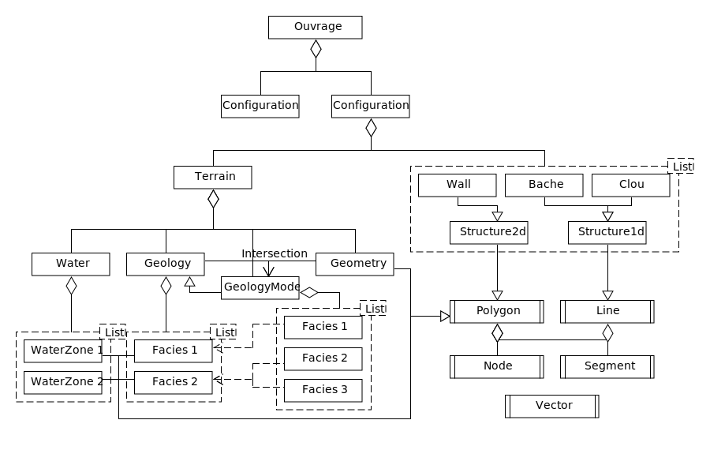

.. SLOG documentation master file, created by
   sphinx-quickstart on Thu Jul 29 17:37:23 2021.
   You can adapt this file completely to your liking, but it should at least
   contain the root `toctree` directive.

Welcome to SLOG's documentation!
================================

.. toctree::
   :maxdepth: 3
   :caption: Contents:

   Quick_Start
   Reference
   About_Us

Indices and tables
==================

* :ref:`genindex`
* :ref:`modindex`
* :ref:`search`
